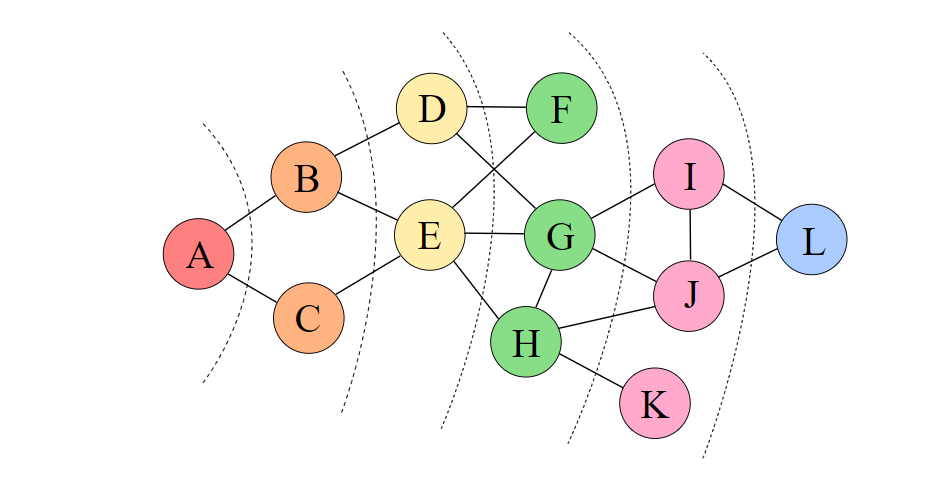
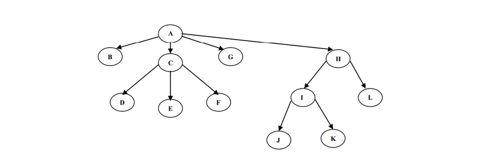

# Поиск в ширину (BFS)
[Поиск в ширину также называют обходом — так же, как поиск в глубину и все другие обходы, он посещает все вершины графа по одному разу, только в другом порядке: по увеличению расстояния до начальной вершины. То есть приоритет посещения получают соседние вершины из графа по отношению обрабатываемой вершины.
Это напоминает волну.
Из рисунка видно порядок посещения вершин. 
Каждыый уровень посещения окрашен в разный цвет. После вершины A идут соседние вершины B и C . Затем посещаются вершины D и E. И так далее.]: #
.
### Алгоритм
1. Выбирается произвольная вершина в графе и помещается в очередь.
2. Ищем все смежные вершины с выбраной вершиной.
2.Помещаем в конец очереди все  вершины которые найдем.
3. Помечаем вершину с которой работали как пройденую.
4. Удаляем анализируемую вершину из очереди.
5. Из очереди берется следующая вершина и выполняется пункт 2.
6. Когда все вершины пройдены программа заканчивает работу.

[ Алгоритм
1.Выбирается произвольная вершина в графе и помещается в очередь.
2.Ищем все смежные вершины с выбраной вершиной.
2.Помещаем в конец очереди все  вершины которые найдем.
3.Помечаем вершину с которой работали как пройденую.
4.Удаляем анализируемую вершину из очереди.
5.Из очереди берется следующая вершина и выполняется пункт 2.
6.Когда все вершины пройдены программа заканчивает работу.]: #

.

[В итоге, когда очередь опустеет, мы по одному разу обойдём все достижимые вершины, причём до каждой дойдём кратчайшим путём. Длины кратчайших путей можно посчитать, если завести для них отдельный массив 𝑑 и при добавлении в очередь пересчитывать по правилу d = в + 1.
 Также можно компактно сохранить дополнительную информацию для восстановления самих путей, заведя массив «предков», в котором для каждой вершины хранится номер вершины из которой мы в неё попали.]: #

[Этот вид обхода соответствует прохождению узлов в горизонтальном
порядке (слева направо), в соответствии с матрицей смежности в порядке возрастания длины пути от корня к вершине. Начнем обход в ширину графа
, начиная с вершины А, – A B C G H D E F I L J K. Применяется как для неориентированный графов так и для
Ориентированных
То есть сначала заходим в вершину А заносим ее в список.]: #

Queue А.
   

[Смотрим какие вершины по отношению вершины А являются смежными.Это вершины  H G C B. Помечаем вершину А как пройденую и удаляем ее из списка.
Заносим в список вершины B C G H.]: #  

 Queue  H G C B. 
 

[Затем начиная с вершыны В она самая левая ищем ей смежные вершины. Смежных вершин для вершины В нет. Помечаем вершину В пройденой , удаляем ее из списка и переходим к вершине С.]: #

Queue   H G C. 
 

  [У вершины С есть 3 смежные вершины D E F. Заносим их в конец списка и помечаеи вершину С пройденой. Выталкиваем ее из списка.]: #

  
  Queue F E D H G.
   

[На очереди вершина G . У вершыны G нет смежных вершин. Помечаем ее как пройденую и выталкиваем из списка.]: #
 
  Queue F E D H.
   

[Переходим к вершине H. У вершины H 2 смежные вершины. Заносим их в список.А вершину H помечаем как пройденую и удаляем из списка.]: # 

 
  Queue I L F E D.
   

[И так далее:]: #

Queue Список I L F E.  
Queue Список I L F.      
Queue Список I L. 
Queue Список K J I. 
Queue Список K J. 
Queue Список K. 
Queue Список . 

 

[Для реализации обхода графа в ширину используется структура
очереди, в которой должны временно храниться вершины, имеющие
смежные вершины на более низком уровне, чтобы на более низком уровне
вершины также можно было бы обрабатывать слева направо.]: #

[Просто подумайте, сколько всего нам нужно для выполнения поиска в ширину (BFS).Очередь, длина которой должна соответствовать количеству Вершин.
Граф, в котором должны храниться вершины.
Связанный список для хранения смежных вершин, количество которых не должно превышать количество вершин.]: #

[Итак, максимально необходимым пространством будет длина Вершин.
Чтобы запустить поиск в ширину, нам нужно просканировать вершины, а также ребра.Это происходит
 приблизительно так]: #

 

## Эффективность поиска в ширину (BFS)

[Эффективность
Плюсы:
Простота реализации, так как BFS является одним из наиболее простых алгоритмов обхода графа.
Удобство нахождения связанных компонентов, так как BFS сначала перебирает все доступные вершины и только потом переходит на следующий уровень, то таким образом можно найти всё вершины достижимые от заданной точки.
Гарантирует нахождения кратчайшего пути в невзвешенном графе.
Минусы:
Требует дополнительную память, так как нужно хранить порядок обхода вершин. Соответсвенно алгоритм требует по памяти О(V), где V — количество вершин в графе.
Время выполнения для поиска в ширину (BFS) : O (V + E)
E — количество ребер .
Алгоритм бесполезен для графов с отрицательными весами, там как BFS не учитывает вес ребра.
Не способен генерировать оптимальный путь для взвешенных графов. Путь может быть найден, но не факт, что он будет оптимальным.]: #

#### Требует дополнительную память О(V)
#### Время выполнения для поиска в ширину (BFS) : O (V + E)

## Применение

[Поиск в ширину может применяться для решения задач, связанных с теорией графов:
Волновой алгоритм поиска пути в лабиринте
Волновая трассировка печатных плат
Поиск компонент связности в графе
Поиск кратчайшего пути между двумя узлами невзвешенного графа
Поиск в пространстве состояний: нахождение решения задачи с наименьшим числом ходов, если каждое состояние системы можно представить вершиной графа, а переходы из одного состояния в другое — рёбрами графа
Нахождение кратчайшего цикла в ориентированном невзвешенном графе
Нахождение всех вершин и рёбер, лежащих на каком-либо кратчайшем пути между двумя вершинами 
𝑎 и 𝑏
Поиск увеличивающего пути в алгоритме Форда-Фалкерсона (алгоритм Эдмондса-Карпа)]: #
